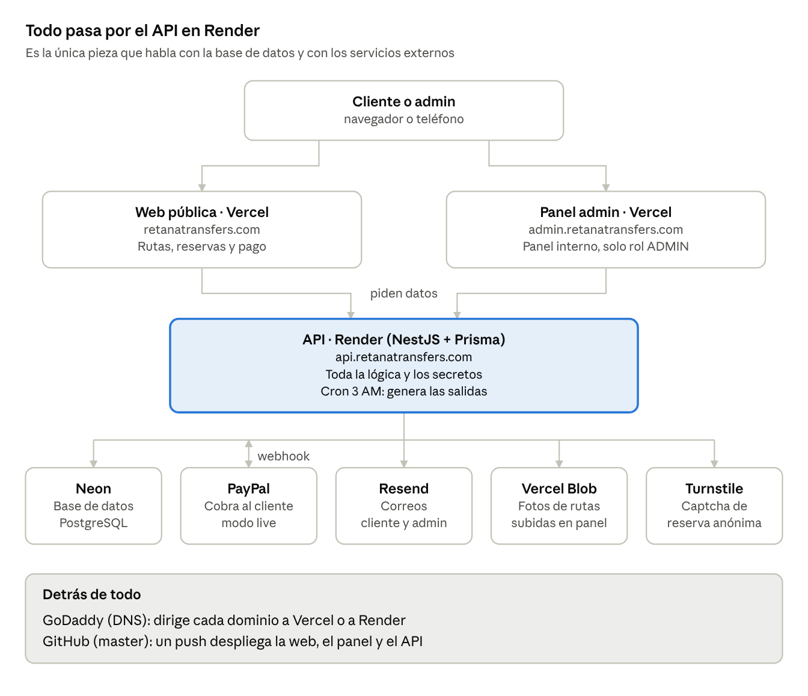

# Mapa del sistema — Retana Transfers

Revisado el 3 de octubre de 2026. Versión editable en línea:
https://claude.ai/code/artifact/aa849e41-c11a-4419-aaf4-e23fee130005

La web y el panel le piden todo al API. El API es la única pieza que habla con
Neon, PayPal, Resend, Vercel Blob y Turnstile: si el API duerme, todo el sistema
queda en pausa.

## Qué hace cada plataforma

| Pieza | Plataforma | Dirección | Qué hace | Plan actual |
| --- | --- | --- | --- | --- |
| Web pública | Vercel (`shuttle-tamarindo-web`) | retanatransfers.com | Rutas, precios, reservas y pago | Pro |
| Panel admin | Vercel (`shuttle-tamarindo-admin`) | admin.retanatransfers.com | Gestión de rutas, horarios, reservas y pagos; solo rol ADMIN | Pro |
| API | Render (`shuttle-tamarindo`) | api.retanatransfers.com | Toda la lógica, los secretos y el cron de las 3 AM | Free (se duerme) |
| Base de datos | Neon (PostgreSQL, us-east-2) | — | Guarda todos los datos | Free (6 h de historial) |
| Pagos | PayPal | — | Cobra al cliente y avisa al API por webhook | Live |
| Correos | Resend | — | Bienvenida, confirmación de reserva y aviso al admin | Free |
| Fotos de rutas | Vercel Blob | — | Guarda las fotos que se suben desde el panel | Público |
| Anti-bots | Cloudflare Turnstile | — | Captcha de la reserva sin cuenta | Free |
| Dominio y DNS | GoDaddy | retanatransfers.com | Dirige cada dominio a Vercel o a Render | — |
| Código | GitHub (`master`) | — | Un push despliega web, admin y API | — |

## Para qué se usa Neon

| Tabla | Qué guarda |
| --- | --- |
| `User` | Clientes y administradores (login) |
| `Route` | Las rutas, con precio y foto |
| `RouteSchedule` | Los horarios de cada ruta |
| `Trip` | Las salidas por fecha; las crea el cron de las 3 AM para los próximos 60 días |
| `Reservation` / `Booking` | Las reservas de los clientes |
| `Payment` | Los pagos de PayPal |
| `PaymentMethodConfig` / `PricingSettings` | Configuración que se cambia desde el panel |

## Cómo viaja una reserva

1. El cliente abre retanatransfers.com (Vercel). La web le pide rutas y precios al API (Render), que los lee de Neon.
2. Elige una salida. Si reserva sin cuenta, resuelve el captcha de Turnstile y el API lo valida.
3. El API calcula el importe con los datos de Neon (nunca lo pone el navegador) y crea la orden en PayPal.
4. El cliente paga en PayPal. El API cobra, verifica el monto, guarda el pago y confirma la reserva en Neon.
5. Si el cliente cierra la ventana antes del paso 4, el webhook de PayPal confirma la reserva igual.
6. El API envía por Resend la confirmación al cliente y el aviso al admin.
7. El admin ve la reserva en admin.retanatransfers.com: el panel se la pide al API y el API la lee de Neon.

## Puntos débiles y qué cuesta resolverlos

| Pieza | Problema en el plan gratis | Solución | Costo |
| --- | --- | --- | --- |
| Render (API) | Se duerme tras 15 min sin tráfico; tarda ~1 min en despertar y el cron de las 3 AM puede no correr | Instancia 0.5c-512mb (antes Starter) | $7/mes |
| Neon (base) | Solo 6 h de historial para restaurar | Plan Launch (por uso, hasta 7 días de historial) | ~$1–5/mes si se apaga sola; ~$19 si queda encendida 24/7 |

Neon también se apaga tras 5 min sin uso, pero despierta en menos de un
segundo: no hace falta mantenerla despierta. Un ping para Render nunca debe
consultar la base.
